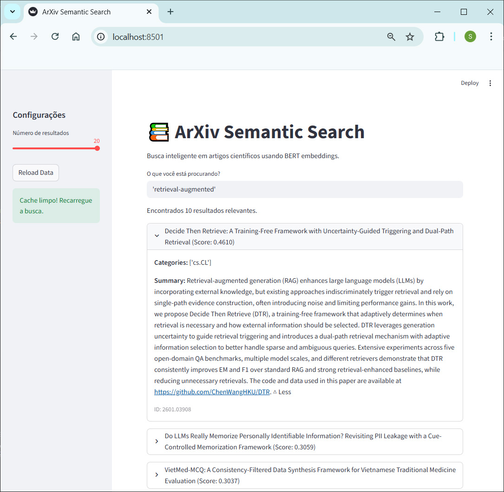

# MBA: Machine Learning in Production — ITI | UFSCar

## Projeto  
## Arquitetura de Microsserviços para Ingestão, Processamento e Busca Semântica  
## de Artigos Científicos (arXiv) utilizando Arquitetura Medalhão (Bronze/Silver)

Projeto acadêmico focado na aplicação prática de **boas práticas de Engenharia de Software, Data Engineering, Docker, CI/CD e Cloud AWS**, com evolução progressiva de um ambiente local para uma infraestrutura em nuvem moderna, observável e financeiramente eficiente.

---

## 🧠 Visão Geral da Arquitetura

Este projeto implementa uma **arquitetura de microsserviços orientada a eventos** para ingestão, processamento e consulta semântica de artigos científicos do repositório **arXiv**.

A solução segue o padrão de **Arquitetura Medalhão**, organizando os dados em camadas:

- **Bronze:** dados brutos ingeridos
- **Silver:** dados limpos, enriquecidos e prontos para consulta

O projeto evolui em fases:
- **Fases 1 a 3:** ambiente local com Docker, simulando serviços cloud (MinIO como S3 local)
- **Fase 4:** migração para AWS utilizando Infraestrutura como Código (Terraform)
- **Fase 5:** observabilidade, monitoramento e controle de custos (FinOps)

A arquitetura prioriza:
- Separação de responsabilidades
- Automação
- Segurança por padrão (least privilege)
- Eficiência de custos
- Reprodutibilidade

---

## 🏗️ Estrutura do Projeto (Monorepo)

O projeto está organizado em um **monorepo**, dividido em fases independentes, cada uma com responsabilidade clara e documentação própria.

### 🟢 Fase 1 — Ingestion Service  
📁 [`./ingestion_service`](./ingestion_service)

- **Responsabilidade:** Coleta de dados (scraping) e persistência bruta (camada Bronze)
- **Status:** ✅ Implementado e Testado localmente
- **Tecnologias:** Python, FastAPI, Docker, MinIO (simulação local do S3)
- **Versionamento:** v0.1.0
- **Execução:**
  ```bash
  docker compose up --build -d
  ```
- **Documentação Swagger:** http://localhost:8000/docs
- **Console MinIO:** http://localhost:9000
- **Leia:** `README.md` e `passo_a_passo_fase_1.md`

### 🟢 Fase 2 — Processing Service
📁 [`./processing_service`](./processing_service)

- **Responsabilidade:** Limpeza de dados, geração de embeddings e persistência refinada (camada Silver)
- **Status:** ✅ Implementado e Testado localmente
- **Tecnologias:** Python, Pandas/Polars, BERT/OpenAI, VectorDB
- **Versionamento:** v0.2.0
- **Execução:**
  ```bash
  docker compose down   # parar fase anterior (conflito de porta)
  docker compose up --build -d
  ```
- **Documentação Swagger:** http://localhost:8001/docs
- **Console MinIO:** http://localhost:9000
- **Leia:** `README.md` e `passo_a_passo_fase_2.md`

### 🟢 Fase 3 — Frontend Service
📁 [`./frontend_service`](./frontend_service)

- **Responsabilidade:** Interface do usuário para busca e visualização dos artigos
- **Status:** ✅ Implementado e Testado localmente
- **Tecnologias:** Streamlit
- **Versionamento:** v0.3.0
- **Execução:**
  ```bash
  docker network create arxiv-shared
  docker compose up --build -d
  ```
- **Interface Web:** http://localhost:8501
- **Console MinIO:** http://localhost:9000
- **Leia:** `README.md` e `passo_a_passo_fase_3.md`
- **📸 Screenshot — Busca Semântica**
  

### 🟢 Fase 4 — AWS Infrastructure (IaC com Terraform)
📁 [`./aws_infrastructure`](./aws_infrastructure)

- **Responsabilidade:** Provisionamento da infraestrutura em nuvem
- **Status:** ✅ Implementado e Validado (IaC + Deploy funcional)
- **Tecnologias:** AWS ECS Fargate, S3, ECR, EventBridge, IAM, Terraform
- **Destaques:**
    - Tasks batch agendadas
    - Uso de Fargate Spot (FinOps)
    - Data Lake em S3 (Bronze/Silver)
    - IAM com princípio do menor privilégio
- **Versionamento:** v0.3.1
- **Leia:** `README.md` e `passo_a_passo_fase_4.md`

### 🟢 Fase 5 — Observabilidade, Monitoramento e FinOps
📁 *Integrada à Fase 4*

- **Responsabilidade:** Monitoramento, auditoria e controle de custos
- **Tecnologias:** CloudWatch Logs & Metrics, EventBridge Events, AWS Budgets
- **Destaques:**
    - Logs centralizados
    - Alarmes de falha de tasks
    - Orçamento mensal protegido
    - Governança mínima e profissional

---

## 🚀 Como Executar (Geral)

> [!IMPORTANT]
> **Conflito de Portas entre Serviços**
>
> Cada microserviço foi projetado para executar de forma isolada, subindo sua própria infraestrutura local (ex.: MinIO na porta 9000).
>
> 🔴 **Antes de iniciar uma fase, é obrigatório parar a fase anterior:**
> ```bash
> docker compose down
> ```
> Caso contrário, ocorrerá erro de porta em uso (Conflict).

> [!IMPORTANT]
> **Configuração de Variáveis de Ambiente**
>
> Antes de executar cada microserviço, é necessário criar um arquivo `.env` na raiz da respectiva fase.
>
> Os exemplos completos encontram-se em:
> - `passo_a_passo_fase_1.md`
> - `passo_a_passo_fase_2.md`
> - `passo_a_passo_fase_3.md`
>
> Cada serviço possui seu próprio `README.md` com instruções detalhadas.

---

## 🏛️ Decisões Arquiteturais

1.  **Arquitetura Medalhão** para rastreabilidade e qualidade dos dados
2.  **Microsserviços** para isolamento de responsabilidades
3.  **Containers** para portabilidade e padronização
4.  **Evolução planejada** de ambiente local para cloud
5.  **Workloads batch e agendados** visando eficiência de custos (FinOps)
6.  **Infraestrutura como Código** para reprodutibilidade

---

## 🎓 Escopo Acadêmico

Este projeto foi desenvolvido com fins acadêmicos no contexto do **MBA em Machine Learning in Production**, priorizando:
- Boas práticas de arquitetura
- Observabilidade
- Segurança
- Controle de custos

Aspectos como alta disponibilidade global e escalabilidade massiva não fazem parte do escopo, mas a arquitetura é compatível com tais evoluções.

---

## 📝 Autor

**Saulo Santos**

- GitHub: [https://github.com/Prof-Saulo-Santos](https://github.com/Prof-Saulo-Santos)
- LinkedIn: [https://www.linkedin.com/in/santossaulo/](https://www.linkedin.com/in/santossaulo/)